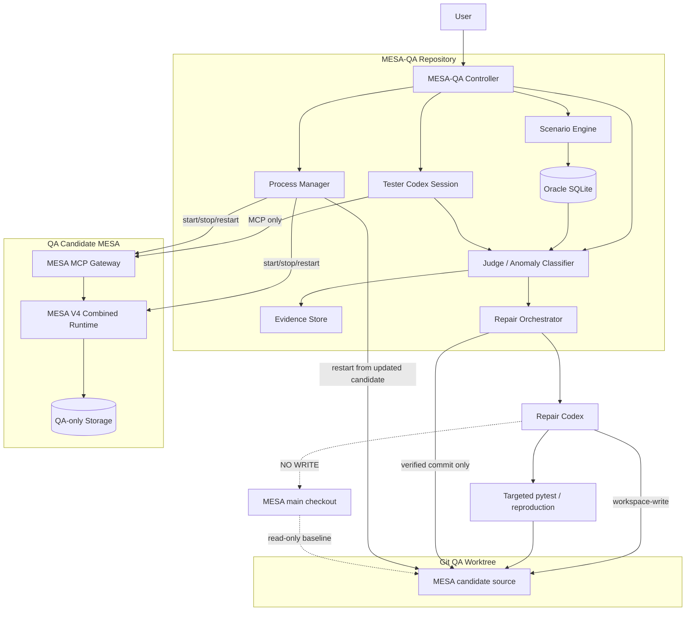
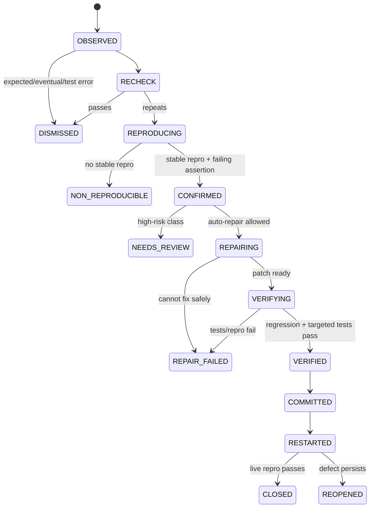
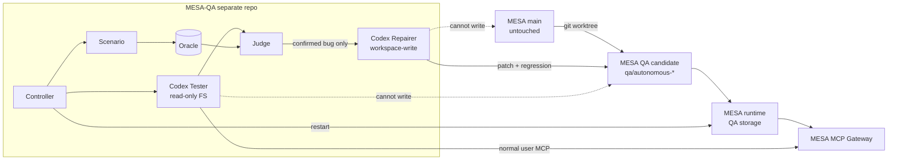

# MESA-QA — Autonomous Resident Test Engineer
## Architecture, Safety Model, Implementation Specification & Build Plan

**Status:** Final architecture decision / agent-ready implementation specification  
**Target:** Separate `MESA-QA` repository  
**System under test:** MESA, using its real MCP/API/runtime surfaces  
**Primary test engineer:** Codex CLI  
**Core principle:** Attach → use → observe → reproduce → repair in isolated worktree → verify → continue → detach

---

# 0. Executive Decision

MESA-QA is a **fully external QA harness and autonomous test-engineer system**. It is not part of MESA Core, is not imported by MESA, is not a runtime dependency of MESA, and must be removable without leaving test-engineer logic inside MESA.

MESA-QA connects a Codex-based test engineer to a real MESA instance through MESA's existing MCP surface. Codex behaves like a long-lived normal AI user rather than a load generator: it creates memories, recalls them, corrects them, forgets them, changes sessions, creates conflicts and duplicates, asks current/historical questions, waits between operations, and evaluates the returned behavior against an independent ground-truth oracle.

When behavior appears incorrect, MESA-QA does not immediately modify source code. It moves through a strict pipeline:

```text
DETECT
  → RECHECK
  → REPRODUCE
  → REGRESSION EVIDENCE
  → ROOT CAUSE
  → REPAIR IN QA WORKTREE
  → TARGETED TESTS
  → REPRODUCTION PASS
  → COMMIT TO QA BRANCH
  → RESTART QA MESA
  → CONTINUE ENDURANCE TEST
```

The normal MESA checkout and normal MESA storage are never writable by the autonomous repair agent.

The runtime under test is launched from a dedicated Git worktree/branch such as:

```text
MESA main checkout             /home/yasin/Desktop/MESA
                               READ-ONLY TO MESA-QA

QA candidate worktree          /home/yasin/Desktop/MESA-QA-candidate
branch                         qa/autonomous-20260814
                               WRITABLE ONLY BY REPAIR CODEX

QA storage                     /home/yasin/.local/share/mesa-qa/runs/<run_id>/mesa-storage
                               TEST DATA ONLY
```

At the end of the run, the user chooses whether to review/cherry-pick/merge any QA branch commits. If all QA artifacts and the worktree are deleted, the original MESA repository remains unchanged.

---

# 1. Problem Being Solved

Traditional MESA tests answer questions such as:

- Does a unit function return the expected value?
- Does an endpoint work?
- Does a worker recover after failure?
- Does the system survive sustained request load?

MESA-QA answers a different product-level question:

> Can a real AI agent use MESA as long-term memory for hours, through normal interfaces, while information changes over time, sessions change, memories are corrected or forgotten, and the system is restarted — and can an autonomous coding agent identify and repair real defects discovered during that usage without risking the source-of-truth repository?

This is **behavioral endurance / resident-agent dogfooding**, not performance soak testing.

MESA-QA must therefore prioritize **semantic correctness, durability, temporal correctness, retrieval behavior, memory lifecycle correctness, MCP reliability, embedding/projection consistency as externally observable, and repairability** rather than requests-per-second.

---

# 2. Non-Goals

MESA-QA v1 MUST NOT become:

- a replacement for MESA's existing unit/integration/regression tests;
- a high-RPS load generator;
- a benchmark replacement;
- a production monitoring daemon;
- a permanent component of MESA Core;
- a direct database editor;
- a second implementation of MESA business logic;
- an autonomous merger to `main`;
- an autonomous dependency/migration/security-policy rewriter;
- a system that decides correctness only from an LLM's subjective opinion.

The existing `mesa_evals/soak_test.py` remains the performance soak tool. MESA-QA is a separate class of testing.

---

# 3. Existing MESA Capabilities to Reuse

The implementation agent MUST inspect the current target MESA repository before coding and bind to the actual current contracts. Do not duplicate facilities already present.

The current MESA snapshot already provides the important foundation:

```text
MESA Core
├── memory runtime
├── API/backend
├── storage
├── workers/queue
├── SDK/client
├── evaluation/benchmark infrastructure
├── observability/logging
└── mesa_mcp
    ├── Codex CLI lifecycle
    ├── authenticated MCP gateway
    ├── Streamable HTTP transport
    └── durable MCP operation handling
```

The current Codex-facing MCP tool set includes the equivalent of:

```text
mesa_health
mesa_recall
mesa_remember
mesa_improve
mesa_forget
mesa_get_operation_status
```

MESA-QA v1 MUST use these existing public tools rather than adding a second memory interface.

MESA's existing Codex integration also already supports project/workspace binding and protected credentials. Reuse it where practical instead of implementing a competing authentication path.

---

# 4. Architectural Principles

## 4.1 Complete externality

Dependency direction is one-way:

```text
MESA-QA  ─────uses─────>  MESA

MESA     ───X imports──>  MESA-QA
```

MESA does not know that MESA-QA exists.

## 4.2 Test through real user surfaces

Normal test behavior MUST use MCP.

Forbidden normal-user path:

```text
Tester → import mesa_storage → query DB directly
```

Required normal-user path:

```text
Tester Codex
   ↓ MCP
MESA MCP Gateway
   ↓ canonical MESA runtime
memory / retrieval / workers / storage / projections
```

Direct internal inspection is not allowed to determine user-visible correctness.

## 4.3 Independent oracle

MESA cannot be both the system under test and the source of expected truth.

MESA-QA therefore owns a tiny independent oracle database that records scenario truth.

```text
Scenario Event
    ├── updates Oracle Truth
    └── tells Tester what happened

Tester asks MESA
    ↓
MESA Answer
    ↓
Judge compares with Oracle
```

## 4.4 Repair isolation

All autonomous code edits occur in the QA candidate worktree, never the original checkout.

## 4.5 Evidence before repair

No confirmed failing reproduction = no autonomous source modification.

## 4.6 Low-resource operation

The default workload must behave like a human/agent, not like Locust:

```text
normal delay:       30–120 s between user actions
micro-burst:        maximum 2–4 related operations
parallelism:        1 by default
resident duration:  2 / 4 / 8 / 12+ hours configurable
```

The controller sleeps outside Codex processes whenever possible.

## 4.7 Fail closed

If MESA MCP, worktree identity, test storage isolation, or Codex permission boundaries cannot be proven, MESA-QA must abort instead of guessing.

---

# 5. Final System Architecture



---

# 6. Trust & Permission Boundaries

The architecture must have four distinct trust zones.

## Zone A — Original MESA checkout

```text
Permission: read-only to MESA-QA
Purpose: baseline / source for worktree creation
Autonomous writes: forbidden
Automatic merge: forbidden
Automatic push: forbidden
```

Before and after every QA run, record:

```text
main_repo_path
main_HEAD
main_branch
main_git_status
```

At teardown, assert `main_HEAD` is unchanged unless the user changed it outside MESA-QA.

## Zone B — Candidate worktree

```text
Permission: writable by Repair Codex only
Branch: qa/autonomous-<timestamp or run_id>
Purpose: run the DUT and receive verified repair commits
```

Tester Codex does not need source write access here.

## Zone C — QA runtime data

Contains only synthetic QA data:

```text
runs/<run_id>/
├── mesa-storage/
├── gateway-control.db
├── oracle.db
├── controller.db
├── logs/
├── evidence/
└── reports/
```

Never reuse the user's normal `MESA_STORAGE_ROOT`.

## Zone D — Tester Codex workspace

Tester Codex runs from the `MESA-QA` repo or an isolated run workspace.

Filesystem sandbox: read-only preferred.  
MCP allowlist: MESA tools only.  
MCP tool approval: pre-approved for the QA-only MESA binding so the test can run unattended.  
No source-edit permission on MESA.

---

# 7. Two Codex Execution Profiles

Use the same Codex product but two sharply separated execution profiles.

## 7.1 TESTER profile

Role:

> Long-lived AI user and QA engineer using MESA through MCP.

Capabilities:

- call MESA MCP tools;
- reason about scenario state;
- ask realistic recall/context questions;
- create/correct/forget test memories;
- inspect MCP operation status;
- report observed actual results;
- classify surprising behavior as a candidate anomaly.

Must not:

- modify MESA source;
- inspect internal MESA databases to decide expected behavior;
- patch code;
- change Git history;
- use unrelated MCP servers.

Recommended Codex configuration concept:

```toml
sandbox_mode = "read-only"
approval_policy = "never"

[mcp_servers.mesa]
# use the MESA-managed Streamable HTTP configuration
required = true
enabled_tools = [
  "mesa_health",
  "mesa_recall",
  "mesa_remember",
  "mesa_improve",
  "mesa_forget",
  "mesa_get_operation_status"
]
default_tools_approval_mode = "approve"
```

Do not hard-code tokens into this file. Use the MESA credential mechanism / environment variable binding.

## 7.2 REPAIR profile

Role:

> Software engineer who receives a confirmed defect and works only inside the QA candidate worktree.

Capabilities:

- inspect source;
- write a regression test;
- run targeted tests;
- make a minimal source patch;
- run formatting/static checks relevant to changed files;
- commit verified fixes to `qa/autonomous-*`.

Recommended boundary:

```text
CWD: candidate worktree
sandbox: workspace-write
network: off unless a test absolutely requires an approved local endpoint
MCP: disabled by default
push: forbidden
merge main: forbidden
```

The repair agent gets evidence through prompt/stdin or read-only evidence files, not by being given unrestricted access to the user's full machine.

---

# 8. Why Two Profiles Instead of One Unrestricted Codex

One unrestricted agent creates a serious test-validity problem:

```text
source code knowledge
       ↓
agent knows implementation
       ↓
normal-user behavior becomes biased
```

Separating Tester and Repair gives a clean boundary:

```text
Tester knows WHAT happened.
Repairer investigates WHY it happened.
```

They may be two Codex sessions controlled by the same MESA-QA process, but they must use separate working directories, permission profiles, and prompts.

---

# 9. Runtime Strategy: Test the Candidate Worktree from the Beginning

Do not run the endurance session from the user's original `main` directory.

At `mesa-qa init`:

```text
MESA/main HEAD
    ↓ create worktree + branch
qa/autonomous-<run_id>
    ↓
launch MESA runtime from worktree
    ↓
Tester exercises this candidate
```

If bug #1 is fixed:

```text
candidate commit A
↓ restart MESA from same worktree
↓ continue test
```

If bug #2 is fixed later:

```text
candidate commit A
candidate commit B
↓ restart
↓ continue test
```

At the end:

```text
main                  unchanged
qa/autonomous-*       contains only QA repair commits
```

This makes continuous autonomous improvement possible without ever mutating main.

---

# 10. Process Topology

Default low-resource topology:

```text
Process 1: MESA V4 combined runtime
Process 2: MESA MCP gateway
Process 3: MESA-QA controller
Process 4: Codex tester invocation (short-lived / resumed)
Process 5: Codex repair invocation (only when needed)
```

Do not keep multiple full MESA candidate instances running continuously on a weak machine.

During repair verification:

1. pause tester scheduling;
2. keep or stop the current DUT depending on reproduction needs;
3. run regression/unit tests in the worktree;
4. if source patch is verified, stop DUT;
5. restart the same candidate runtime from updated worktree;
6. run a short smoke/reproduction probe;
7. continue endurance schedule.

This avoids a permanent second MESA process.

---

# 11. MESA Runtime Profile

The primary target is the supported V4 `combined` runtime because the Codex gateway's modern lifecycle tools target the V4 durable memory path.

The process manager must configure a QA-only runtime environment, conceptually:

```text
MESA_RUNTIME_PROFILE=combined
MESA_STORAGE_ROOT=<run_dir>/mesa-storage
MESA_PORT=<qa_port>
MESA_API_KEY=<qa_credential>
MESA_PRINCIPAL_ID=<qa_service_principal>
MESA_PRINCIPAL_TYPE=SERVICE
MESA_PRINCIPAL_STATUS=active
MESA_MODEL_ENABLED=<profile dependent>
MESA_EXTERNAL_PROVIDER_ENABLED=<profile dependent>
```

The implementation agent must use the current target MESA documentation/CLI to provision the correct V4 key, ACL, workspace, dataset and agent session permissions.

MESA-QA must not import storage repositories to bypass normal provisioning.

---

# 12. Low-Resource Profiles

MESA-QA should ship at least three runtime/test profiles.

## `lite`

Purpose: long behavioral lifecycle test on weak hardware.

```yaml
cadence_seconds: [45, 120]
parallel_actions: 1
restart_every_minutes: 90
repair_enabled: true
full_suite_on_every_fix: false
resource_sampling_seconds: 60
```

Use the lightest valid MESA runtime/provider configuration available.

## `standard`

```yaml
cadence_seconds: [20, 75]
parallel_actions: 1
micro_burst_max: 3
restart_every_minutes: 60
repair_enabled: true
```

## `stress-behavioral`

Still not a load test; increases behavioral concurrency only:

```yaml
cadence_seconds: [5, 30]
parallel_actions: 2
micro_burst_max: 5
```

Performance soak remains outside MESA-QA.

---

# 13. Scenario Engine

The Scenario Engine creates a coherent synthetic world rather than random strings.

Each scenario has:

```text
actors
projects
preferences
facts
relationships
valid_from / valid_to
confidence
memory type
expected visibility
history
```

Example world:

```text
Person: Alex
Projects: Atlas, Nova

T0: Atlas backend = FastAPI
T1: Atlas database = PostgreSQL
T2: Sarah works on Atlas
T3: Atlas backend changes to Spring Boot
T4: Sarah leaves Atlas
T5: Nova launch date changes
T6: old Atlas database fact is explicitly forgotten
```

The scenario engine must generate **events**, not expected MESA internals.

Example event:

```json
{
  "event_id": "evt_0042",
  "kind": "fact_change",
  "entity": "project:atlas",
  "field": "backend",
  "old_value": "FastAPI",
  "new_value": "Spring Boot",
  "effective_at": "..."
}
```

The Oracle applies the event deterministically.

---

# 14. Oracle Model

Use SQLite by default. Keep it intentionally simple.

Suggested tables:

```text
runs
entities
facts
fact_history
events
questions
expected_answers
observations
anomalies
bugs
repairs
```

Minimum fact schema:

```text
fact_id
entity_key
field
value_json
valid_from
valid_to
status        CURRENT | HISTORICAL | FORGOTTEN
source_event_id
```

The Oracle should support deterministic queries such as:

```text
current(project:atlas, backend)      -> Spring Boot
historical(project:atlas, backend)   -> [FastAPI, Spring Boot]
forgotten(project:atlas, database)   -> true
```

Do not try to reimplement MESA ranking or embeddings in the Oracle.

---

# 15. Question & Action Taxonomy

The test workload should mix these classes.

## A. Write lifecycle

- remember a new fact;
- remember multiple related facts;
- submit a duplicate fact;
- submit semantically similar wording;
- correct a fact;
- correct a fact twice;
- forget a fact;
- attempt later recall of forgotten fact.

## B. Current truth

- "What backend does Atlas use now?"
- "Who is currently on project Atlas?"

## C. Historical truth

- "What backend did Atlas use before Spring Boot?"
- "Was Sarah ever on Atlas?"

## D. Cross-session persistence

- write in session A;
- end/rotate session;
- ask in session B.

## E. Restart durability

- create facts;
- wait for durable operation completion;
- restart MESA;
- recall them.

## F. Conflict and supersession

- contradictory fact;
- correction;
- near-duplicate correction;
- current truth must remain singular.

## G. Idempotency

- retry same idempotency key;
- resend semantically same request with new key;
- ensure logical duplicate behavior matches contract.

## H. Forget/purge safety

- forget;
- restart;
- query again;
- old content must not resurrect where contract says it should not.

## I. Retrieval quality

- paraphrased questions;
- noisy but relevant queries;
- multi-fact questions;
- limited context budget.

## J. MCP behavior

- operation status polling;
- timeout/retry behavior;
- omitted optional fields;
- valid boundary inputs;
- safe invalid inputs.

---

# 16. Tester Codex Interaction Model

Do not hold one fragile 8-hour Codex turn open.

Use **short actions inside resumable tester threads**.

Recommended model:

```text
Controller
  ↓ waits 30–120 sec
create next scenario event/question
  ↓
Codex tester turn
  ↓ calls 1–4 MESA MCP tools
returns structured observation
  ↓
Controller stores observation
  ↓
Judge compares
  ↓
sleep
```

Maintain a Codex thread for an epoch, then rotate it.

Suggested defaults:

```text
epoch_actions = 20–30
epoch_max_minutes = 30–45
```

At epoch rotation, create a short deterministic summary from controller state. Do not rely on unlimited Codex conversation context.

MESA itself may be used by the tester as dogfooded long-term memory, but it must never replace the external Oracle.

---

# 17. Structured Tester Output

Every tester turn must produce machine-readable output.

Use Codex non-interactive JSONL event streaming plus a final JSON schema.

Suggested final schema:

```json
{
  "action_id": "act_000123",
  "scenario_event_id": "evt_000077",
  "tools_called": ["mesa_recall"],
  "actual": {
    "answer": "Spring Boot",
    "memory_ids": [],
    "operation_ids": []
  },
  "tester_assessment": "pass|suspicious|infra_error",
  "reason": "short explanation",
  "needs_recheck": false
}
```

The controller, not Codex, assigns final PASS/FAIL against the Oracle whenever the expected result is deterministic.

---

# 18. Judge Design

Use three judge layers in this order.

## Layer 1 — Deterministic assertions

Examples:

```text
expected exact current value
forbidden forgotten value
operation must become terminal
restart must preserve fact
cross-tenant request must fail
```

These are authoritative.

## Layer 2 — Structured semantic comparison

For paraphrased natural-language results, normalize:

- case;
- punctuation;
- entity aliases;
- JSON fields;
- ordered/unordered lists where contract permits.

Prefer deterministic normalization before using an LLM judge.

## Layer 3 — Codex qualitative assessment

Use only for ambiguous relevance/quality observations.

A qualitative failure alone cannot authorize a source repair. It can create a candidate anomaly requiring deterministic reproduction.

---

# 19. Anomaly State Machine



---

# 20. Anomaly Recheck Policy

Before repair, distinguish:

```text
actual product bug
vs
asynchronous projection delay
vs
provider outage
vs
MCP transport error
vs
bad test oracle
vs
ambiguous natural-language answer
```

Default recheck sequence:

1. record full user-level request and response;
2. check operation terminality if a write preceded the read;
3. wait bounded stabilization interval;
4. repeat the same user-level action;
5. repeat once with a fresh tester epoch/session if relevant;
6. only then create a reproduction case.

Immediate escalation exceptions:

- process crash;
- cross-tenant leakage;
- confirmed data resurrection after purge/forget;
- acknowledged write loss;
- obvious corruption.

---

# 21. Reproduction Artifact

Every confirmed bug must get a standalone evidence bundle:

```text
evidence/BUG-0007/
├── bug.json
├── user_sequence.jsonl
├── expected.json
├── actual.json
├── relevant_runtime.log
├── repro.md
└── optional_repro_test_hint.json
```

`bug.json` minimum fields:

```text
bug_id
run_id
first_seen_at
severity
category
scenario_id
preconditions
steps
expected
actual
repeat_count
candidate_commit_before
storage_snapshot_id (if used)
```

No secrets in evidence.

---

# 22. Repair Gate

Autonomous source edits are allowed only when all required gates pass.

## Required gates

```text
G1: anomaly is reproducible
G2: expected behavior is grounded in contract/oracle
G3: a failing regression assertion/test exists or can be produced
G4: current candidate fails that assertion before patch
G5: repair scope is allowed for autonomous modification
```

If any gate fails:

```text
status = NEEDS_REVIEW or NON_REPRODUCIBLE
no source edit
```

---

# 23. Auto-Repair Scope

## Allowed by default

- localized Python logic bugs;
- MCP adapter/validation bugs;
- retrieval eligibility bugs;
- lifecycle state handling bugs where schema change is unnecessary;
- bounded retry/idempotency bugs;
- incorrect defaults/null handling;
- missing regression tests;
- small observability fixes required to diagnose the confirmed issue.

## Must stop for review by default

- schema migrations;
- dependency changes (`pyproject.toml`, `uv.lock`);
- auth/credential model redesign;
- encryption changes;
- deployment/CI secrets;
- broad architectural rewrites;
- destructive migration utilities;
- changes outside the MESA repo;
- changes requiring internet downloads;
- changes that alter public contracts without explicit acceptance criteria.

Repair Codex may propose these changes in the report but must not auto-apply them in v1.

---

# 24. Repair Algorithm

Repair prompt must require this exact order:

```text
1. Read bug evidence.
2. Inspect only the relevant execution path first.
3. Reproduce the defect on the current candidate commit.
4. Add a minimal regression test.
5. Prove the new test FAILS before the fix.
6. Identify root cause.
7. Implement the smallest safe patch.
8. Run the regression test.
9. Run directly affected test module(s).
10. Run targeted lint/type checks if relevant.
11. Produce a concise change summary.
12. Do not change unrelated code.
13. Do not push or merge.
```

If step 5 cannot be demonstrated, stop.

---

# 25. Test Strategy After a Repair

Because the user's machine is limited, do not run the entire test suite after every patch.

Use progressive verification:

```text
Tier 1   new regression test
Tier 2   directly affected test file/module
Tier 3   related subsystem tests
Tier 4   lightweight smoke against restarted candidate
Tier 5   full suite only at configured checkpoints or end of run
```

Example policy:

```yaml
full_suite:
  mode: checkpoint
  every_verified_repairs: 3
  also_at_end: true
  max_duration_seconds: configurable
```

If the full suite is known to be too expensive, report it as pending evidence rather than pretending it ran.

---

# 26. Candidate Commit Policy

A verified auto-repair commit format:

```text
qa: fix BUG-0007 current revision retrieval
```

Commit metadata is recorded in MESA-QA's controller DB:

```text
bug_id
pre_fix_commit
post_fix_commit
files_changed
tests_run
tests_passed
restart_probe_result
```

Never create merge commits automatically.

---

# 27. Runtime Restart Logic

After a verified repair:

```text
pause scheduler
↓
ensure no tester action is in flight
↓
stop MCP gateway if necessary
↓
stop MESA runtime gracefully
↓
confirm process exit
↓
restart MESA from current candidate worktree HEAD
↓
wait /health ready
↓
restart/check MCP gateway
↓
run mesa_health
↓
run bug-specific live reproduction probe
↓
resume scheduler
```

If restart fails, mark the repair `REPAIR_FAILED_RUNTIME` and preserve evidence.

---

# 28. Storage Continuity During the Endurance Run

By default, repairs should restart against the **same QA-only storage**. This is important because the test is validating long-term durability through code evolution/restart.

However, regression tests themselves must use isolated temporary storage.

```text
Endurance DUT storage: persistent for the run
Repair pytest storage: temporary per repair attempt
```

If a repair requires a migration or would make existing QA storage incompatible, stop for manual review.

---

# 29. Resource Monitoring

MESA-QA is not a performance benchmark, but it should detect obvious long-term degradation.

Sample at low cadence:

```text
MESA process RSS
CPU percent
open file descriptors (if available)
thread count
MESA health
MCP health
operation latency
operation failure count
pending/non-terminal operation age
```

Do not retain huge in-memory latency arrays. Store append-only compact observations and rolling aggregates.

Suggested thresholds are configurable and should create warnings rather than automatic code repairs unless a deterministic leak/repro is produced.

---

# 30. Embedding & Projection Validation

MESA-QA should test embeddings primarily through behavior, not by secretly reading vector storage.

Behavioral checks:

- semantically paraphrased recall returns expected current fact;
- correction causes new current fact to win;
- forgotten/superseded data does not appear when contract forbids it;
- restart does not destroy semantic retrieval;
- repeated writes do not create visible semantic duplicates;
- retrieval remains consistent across sessions.

If MESA already exposes safe, generic read-only health/capability/diagnostic information, MESA-QA may record it.

MESA-QA v1 MUST NOT require adding Codex-specific debug backdoors to MESA.

If a future missing observability contract is proven necessary, it should be implemented as a generic MESA developer/health capability, separately reviewed.

---

# 31. MESA-QA Repository Layout

Required target structure:

```text
MESA-QA/
├── README.md
├── LICENSE                     # optional based on project policy
├── pyproject.toml
├── uv.lock                     # if uv is used
├── .gitignore
├── .env.example
├── config/
│   ├── default.yaml
│   ├── lite.yaml
│   └── standard.yaml
├── src/mesa_qa/
│   ├── __init__.py
│   ├── cli.py
│   ├── config.py
│   ├── controller.py
│   ├── state_machine.py
│   ├── models.py
│   │
│   ├── runtime/
│   │   ├── process_manager.py
│   │   ├── mesa_runtime.py
│   │   ├── mcp_gateway.py
│   │   ├── health.py
│   │   └── worktree.py
│   │
│   ├── codex/
│   │   ├── runner.py
│   │   ├── tester.py
│   │   ├── repairer.py
│   │   ├── jsonl.py
│   │   └── schemas.py
│   │
│   ├── mesa/
│   │   ├── bootstrap.py
│   │   ├── mcp_binding.py
│   │   └── contracts.py
│   │
│   ├── scenario/
│   │   ├── engine.py
│   │   ├── generators.py
│   │   ├── world.py
│   │   ├── actions.py
│   │   └── questions.py
│   │
│   ├── oracle/
│   │   ├── db.py
│   │   ├── schema.py
│   │   └── evaluator.py
│   │
│   ├── judge/
│   │   ├── deterministic.py
│   │   ├── semantic.py
│   │   └── classifier.py
│   │
│   ├── repair/
│   │   ├── gate.py
│   │   ├── evidence.py
│   │   ├── verification.py
│   │   └── policy.py
│   │
│   ├── telemetry/
│   │   ├── sampler.py
│   │   ├── resources.py
│   │   └── reports.py
│   │
│   └── storage/
│       ├── controller_db.py
│       └── paths.py
│
├── prompts/
│   ├── TESTER_SYSTEM.md
│   ├── TESTER_TURN.md
│   ├── REPRODUCE.md
│   └── REPAIR.md
│
├── schemas/
│   ├── tester_result.schema.json
│   ├── bug.schema.json
│   └── repair_result.schema.json
│
├── scenarios/
│   ├── basic_memory.yaml
│   ├── temporal_changes.yaml
│   ├── correction_and_forget.yaml
│   ├── restart_durability.yaml
│   └── mixed_endurance.yaml
│
├── tests/
│   ├── unit/
│   ├── integration/
│   └── fixtures/
│
└── runs/                       # gitignored
```

Keep runtime artifacts out of Git.

---

# 32. MESA-QA Configuration Schema

Suggested `config/default.yaml`:

```yaml
mesa:
  repo_path: /absolute/path/to/MESA
  python_path: /absolute/path/to/MESA/.venv/bin/python
  runtime_profile: combined
  port: 18000
  gateway_port: 18765

candidate:
  worktree_root: /absolute/path/to/MESA-QA-candidate
  branch_prefix: qa/autonomous
  reuse_existing: false

run:
  duration_hours: 8
  profile: lite
  seed: 42
  cadence_seconds_min: 45
  cadence_seconds_max: 120
  epoch_actions: 25
  restart_every_minutes: 90

codex:
  binary: codex
  tester_model: null
  repair_model: null
  tester_timeout_seconds: 300
  repair_timeout_seconds: 1200
  json_events: true

repair:
  enabled: true
  max_repairs_per_run: 10
  require_pre_fix_failure: true
  commit_verified_repairs: true
  auto_push: false
  auto_merge: false

verification:
  targeted_tests_only_per_fix: true
  full_suite_at_end: true
  full_suite_every_n_repairs: 3

resources:
  sample_seconds: 60
  warn_rss_mb: 6000
  hard_stop_rss_mb: 12000

safety:
  require_clean_main: true
  forbid_main_branch_write: true
  forbid_network_in_repair: true
  forbidden_repair_paths:
    - .github/
    - deploy/
    - uv.lock
    - pyproject.toml
```

Defaults must be conservative. Do not assume the example absolute paths.

---

# 33. Controller Persistent State

The controller must be crash-resumable.

Suggested state:

```text
run_id
status
started_at
planned_end_at
baseline_main_head
candidate_branch
candidate_head
candidate_worktree
qa_storage_root
mesa_pid
mcp_gateway_pid
current_tester_thread_id
current_epoch
action_count
scenario_cursor
confirmed_bug_count
verified_repair_count
last_health_at
```

Write state transactionally to SQLite or atomic JSON plus SQLite event log.

Prefer SQLite for run metadata and append-only JSONL for raw Codex/runtime events.

---

# 34. Controller Main Loop

Pseudocode:

```python
async def run():
    assert_safety_preconditions()
    ensure_candidate_worktree()
    ensure_qa_storage()
    bootstrap_mesa_candidate()
    start_mesa()
    wait_ready()
    start_mcp_gateway()
    bind_tester_codex_to_mesa()

    while not run_deadline_reached():
        if resource_hard_limit_exceeded():
            halt_with_evidence("RESOURCE_LIMIT")

        event = scenario.next_event()
        oracle.apply(event)

        observation = await tester.execute(event)
        verdict = judge.evaluate(event, observation, oracle)
        persist(event, observation, verdict)

        if verdict.is_candidate_anomaly:
            result = await anomaly_pipeline(verdict)
            if result.verified_repair:
                await restart_candidate()
                await run_live_repro_probe(result.bug_id)

        if scheduled_restart_due():
            await restart_candidate()
            await run_durability_probe()

        await sleep(random_cadence())

    final_verification()
    build_report()
```

No hidden background mutation of main.

---

# 35. CLI Contract

The new repo should expose one main executable:

```text
mesa-qa
```

Minimum commands:

```bash
mesa-qa doctor
mesa-qa init --mesa-repo /path/to/MESA
mesa-qa run --hours 8 --profile lite
mesa-qa status
mesa-qa pause
mesa-qa resume
mesa-qa stop
mesa-qa report <run_id>
mesa-qa teardown <run_id>
```

Optional later:

```bash
mesa-qa reproduce BUG-0007
mesa-qa repair BUG-0007
mesa-qa verify BUG-0007
```

---

# 36. `doctor` Requirements

`mesa-qa doctor` must fail clearly if any prerequisite is missing.

Check:

```text
MESA repo exists
MESA repo is Git repo
MESA main/baseline branch can be identified
MESA main checkout is clean if policy requires it
configured Python exists
Codex CLI exists and is authenticated
Git worktree supported
ports available
MESA runtime module importable
MESA MCP gateway executable/module available
QA root writable
normal MESA storage path is NOT the QA storage path
no candidate worktree accidentally points at main checkout
```

It should not alter MESA.

---

# 37. Worktree Creation

Conceptual command:

```bash
git -C /path/to/MESA worktree add \
  -b qa/autonomous-<run_id> \
  /path/to/MESA-QA-candidate \
  <baseline-commit>
```

After creation verify:

```text
candidate git root == expected candidate path
candidate HEAD == baseline HEAD
candidate branch starts with allowed prefix
candidate path != main path
```

Before every Repair Codex invocation, repeat these assertions.

---

# 38. Python Environment Strategy for a Weak Machine

Do not automatically create a second heavy ML environment if avoidable.

MESA-QA config may point to the already-working MESA Python executable:

```text
/path/to/MESA/.venv/bin/python
```

Run candidate source with:

```text
cwd = candidate_worktree
python = configured MESA Python
```

Python will execute candidate source from the worktree while reusing installed dependencies.

Safety restriction:

> Automated repairs that require dependency changes are not auto-applied in v1.

This makes shared-environment reuse predictable.

---

# 39. MESA MCP Provisioning

The implementation should reuse MESA's existing Codex integration where possible.

Expected workflow concept:

```text
1. QA candidate runtime is running.
2. QA MCP gateway is running with a QA-only control DB.
3. Provision a Codex client/binding for the MESA-QA tester workspace.
4. Bind it to QA tenant/workspace/dataset identifiers.
5. Store the MCP bearer credential using MESA's existing secret-safe mechanism.
6. Verify with MESA's Codex doctor/status tooling.
7. Tester Codex starts only after `mesa_health` succeeds.
```

Do not invent a parallel plaintext-token config if MESA's current lifecycle tooling already provides this.

The implementation agent must inspect the exact current `mesa_mcp/codex_cli.py` contract and use it.

---

# 40. Tester Prompt Contract

`prompts/TESTER_SYSTEM.md` must establish:

```text
You are a QA test engineer acting as a normal AI application using MESA as memory.

Your normal-mode authority is limited to the listed MESA MCP tools.
Do not inspect MESA source code to decide what answer should be returned.
Do not fabricate a tool result.
Do not mark a product bug solely because retrieval wording differs.
Wait for durable operation completion when the workflow requires it.
Report actual tool outputs faithfully.
Use idempotency keys supplied by the controller.
The controller/oracle, not you, is final authority on deterministic expected truth.
```

Each turn receives only the relevant scenario context, action objective and prior compact state needed for that action.

---

# 41. Repair Prompt Contract

`prompts/REPAIR.md` must establish:

```text
You are repairing a confirmed MESA QA defect in an isolated QA worktree.

Hard rules:
- Work only in the current Git worktree.
- Never checkout, merge, reset, push, or modify main.
- Never modify paths forbidden by policy.
- Do not change dependencies or migrations automatically.
- Reproduce before patching.
- Add a regression test and prove it fails pre-fix.
- Make the smallest justified patch.
- Run only the required targeted tests first.
- Do not claim PASS for tests you did not run.
- Stop if the evidence does not support the claimed bug.
```

The controller independently validates Git/path/test results after Codex exits.

---

# 42. Codex Invocation Strategy

Use `codex exec` for orchestration because it is scriptable and supports machine-readable events.

Tester:

```text
codex exec --json ...
```

Capture:

```text
thread.started
turn.started
MCP tool calls
agent message
turn.completed / turn.failed
token usage
```

Persist the thread ID and use `codex exec resume <thread_id>` within an epoch when useful.

Repair:

```text
cwd = candidate worktree
codex exec --sandbox workspace-write --json <repair prompt>
```

Do not use unrestricted/danger-full-access mode.

Exact CLI arguments should be feature-detected against the installed Codex version and isolated behind `codex/runner.py` so future CLI changes do not leak through the codebase.

---

# 43. MCP Tool Policy

Tester Codex should be configured with the smallest possible tool allowlist.

Required:

```text
mesa_health
mesa_recall
mesa_remember
mesa_improve
mesa_forget
mesa_get_operation_status
```

If future MESA adds general-purpose safe read-only diagnostics, they may be opt-in, but v1 must work without them.

No browser, GitHub, shell-MCP or unrelated external tools are required for tester mode.

---

# 44. Idempotency Discipline

The controller owns idempotency keys.

Format example:

```text
qa:<run_id>:<action_id>:<attempt>
```

For intentional retry tests, reuse the exact key.
For a logically new write, generate a new key.

Never let Codex invent uncontrolled random idempotency semantics.

---

# 45. Restart Tests

Scheduled restart scenario:

```text
remember F1
wait terminal
remember F2
wait terminal
record expected oracle
stop runtime
start runtime using same candidate + same QA storage
wait ready
MCP health
recall F1/F2 from new tester session/epoch
compare
```

A repair-triggered restart is not counted as a planned durability restart, but can still produce useful evidence.

---

# 46. Session Rotation Tests

MESA-QA must distinguish:

```text
Codex conversation/thread
MESA agent/session semantics
MCP client binding
scenario identity
```

Do not accidentally treat a Codex context window as MESA persistence.

Regularly rotate Codex tester threads and MESA sessions according to the actual public contract so successful recall proves MESA persistence, not the LLM's conversation memory.

---

# 47. Failure Classes

Standardize categories:

```text
MEMORY_WRITE
MEMORY_RECALL
CURRENT_TRUTH
TEMPORAL_HISTORY
CORRECTION
FORGET_PURGE
DUPLICATE
IDEMPOTENCY
SESSION_PERSISTENCE
RESTART_DURABILITY
MCP_TRANSPORT
OPERATION_FINALITY
RETRIEVAL_QUALITY
ISOLATION
RESOURCE_DEGRADATION
RUNTIME_CRASH
TEST_HARNESS
PROVIDER_EXTERNAL
UNKNOWN
```

This makes final reporting actionable.

---

# 48. Severity

```text
P0
- cross-tenant/principal data leakage
- acknowledged memory loss
- forgotten/purged data resurrection when contract forbids it
- corruption
- repeatable runtime crash on normal valid use

P1
- current truth wrong
- correction not respected
- durable operation stuck/lost
- semantic retrieval reliably misses core expected fact
- MCP valid workflow consistently fails

P2
- intermittent/edge behavior with workaround
- degraded quality
- recoverable retry issue

P3
- diagnostics/usability/reporting issue
```

P0 may halt the endurance loop after evidence capture rather than blindly continuing destructive mutations.

---

# 49. Safety Guards Implemented in Code, Not Only Prompts

Prompts are not enough.

The controller must enforce:

- absolute path equality checks;
- branch prefix check;
- baseline main HEAD check;
- forbidden file diff check;
- process environment allowlist;
- QA storage path containment check;
- port binding to localhost;
- no auto-push;
- no auto-merge;
- repair timeout;
- maximum repairs per run;
- maximum changed files/lines threshold before manual review;
- kill-switch file or CLI command;
- resource hard-stop.

Example patch-size gate:

```yaml
max_auto_changed_files: 8
max_auto_changed_lines: 400
```

Exceeding it changes status to `NEEDS_REVIEW`.

---

# 50. Kill Switch

Support immediate safe stop:

```bash
mesa-qa stop
```

Behavior:

1. prevent new tester turns;
2. terminate active Codex child process gracefully, then force if needed;
3. stop MCP gateway;
4. stop QA MESA runtime;
5. flush state/evidence;
6. leave worktree and storage intact for inspection.

No cleanup should happen automatically on emergency stop.

---

# 51. Teardown

`mesa-qa teardown <run_id>` must be explicit.

Before deletion show/record:

```text
candidate branch
candidate commits ahead of baseline
verified repairs
uncommitted changes
QA storage location
report location
```

Then, only with correct target identity:

```text
stop processes
uninstall/revoke QA MCP credential if provisioned
remove QA worktree
optionally delete QA branch
optionally delete QA storage
preserve final report by default
```

Never delete the MESA main checkout.

---

# 52. Final Report Format

Every run produces:

```text
runs/<run_id>/reports/final.md
runs/<run_id>/reports/final.json
```

Human report:

```text
Run duration
Baseline commit
Final candidate commit
Actions
MESA sessions
Codex tester epochs
Restarts
Writes / recalls / corrections / forgets
Pass ratio by scenario class
Anomalies
Confirmed bugs
Non-reproducible anomalies
Repairs attempted
Repairs verified
Repair commits
Pending manual-review items
Resource trend
Final targeted/full-test evidence
Main checkout integrity result
```

Never report a fix as verified unless the required evidence exists.

---

# 53. Suggested Console Status

```text
MESA-QA Resident Test Engineer
────────────────────────────────────────
Run             qa-20260814-004812
Elapsed         03:42:18 / 08:00:00
Candidate       qa/autonomous-qa-... @ a1b2c3d
MESA            READY
MCP             READY
Tester epoch    7
Actions         186
Pass            178
Anomalies       8
Confirmed bugs  3
Repairs         2 verified / 1 review
Restarts        3
RSS             1.8 GB
Next action     ~54 s
Main integrity  UNCHANGED
```

Use simple terminal output; a web dashboard is not required for v1.

---

# 54. MESA-QA's Own Test Suite

The new repository itself must have tests.

## Unit

- config validation;
- path containment;
- branch guard;
- oracle transitions;
- action generation;
- deterministic judge;
- anomaly state machine;
- patch policy;
- Codex JSONL parser;
- report generation.

## Integration with fake services

- fake MCP/Codex output;
- process restart state;
- tester thread resume parsing;
- simulated repair commit;
- teardown refuses wrong worktree.

## Optional live integration

Marked separately, not default CI:

```text
requires local MESA + Codex auth
```

Do not make the normal MESA-QA unit suite depend on a live model.

---

# 55. Implementation Phases

## Phase 0 — Skeleton & safety first

Deliver:

- package/CLI;
- config;
- doctor;
- run paths;
- Git worktree manager;
- safety assertions;
- controller state DB.

Acceptance:

```text
Can create candidate worktree and prove main untouched.
Can teardown without touching main.
```

## Phase 1 — Runtime lifecycle

Deliver:

- start/stop/restart MESA candidate;
- health wait;
- isolated storage;
- MCP gateway lifecycle;
- logs.

Acceptance:

```text
MESA starts from worktree on QA storage and localhost QA port.
```

## Phase 2 — Existing MESA Codex/MCP binding

Deliver:

- provision tester workspace using existing MESA Codex lifecycle;
- doctor/status;
- tester MCP allowlist;
- `mesa_health` smoke call.

Acceptance:

```text
Tester Codex can call MESA MCP with no plaintext credential in repo.
```

## Phase 3 — Scenario + Oracle

Deliver:

- coherent synthetic world;
- deterministic fact history;
- actions/questions;
- SQLite oracle.

Acceptance:

```text
100% deterministic unit coverage of current/historical/forgotten transitions.
```

## Phase 4 — Tester Codex loop

Deliver:

- `codex exec --json` runner;
- structured output;
- epoch/thread handling;
- cadence;
- MCP action execution.

Acceptance:

```text
1-hour lite run can operate without source edits.
```

## Phase 5 — Judge + anomaly pipeline

Deliver:

- deterministic comparison;
- recheck;
- reproduction evidence bundle;
- classification.

Acceptance:

```text
Injected fake behavioral defect becomes CONFIRMED only after reproduction.
```

## Phase 6 — Repair Codex

Deliver:

- repair profile;
- workspace-write confinement;
- regression-before-fix gate;
- targeted tests;
- patch-size/path policy.

Acceptance:

```text
Known fixture bug can be autonomously repaired in candidate only.
```

## Phase 7 — Restart-after-repair & continuous candidate evolution

Deliver:

- verified commit;
- runtime restart;
- live repro probe;
- continue endurance loop.

Acceptance:

```text
Bug fixed at hour N; run continues on new candidate commit; main unchanged.
```

## Phase 8 — Reporting & teardown

Deliver:

- final JSON/Markdown report;
- resource summary;
- commit summary;
- safe credential/worktree cleanup.

Acceptance:

```text
MESA-QA can be completely detached while preserving report and optional QA branch.
```

---

# 56. Agent Work Packages

The coding agent building MESA-QA should execute in this order.

```text
M001  Initialize repo, pyproject, src layout, tests
M002  Typed config + safe path model
M003  Controller/event/state persistence
M004  Git baseline/worktree guards
M005  Process manager and log capture
M006  MESA candidate runtime adapter
M007  MCP gateway lifecycle adapter
M008  MESA Codex provisioning/binding adapter
M009  Codex exec JSONL runner + schema outputs
M010  Tester profile and prompt contract
M011  Oracle SQLite + deterministic fact model
M012  Scenario engine and built-in scenarios
M013  Deterministic judge
M014  Anomaly/recheck/reproduction pipeline
M015  Evidence bundle format
M016  Repair policy and forbidden-path/size gates
M017  Repair Codex runner
M018  Pre-fix FAIL → patch → post-fix PASS verification
M019  Verified commit + candidate restart + live probe
M020  Resource sampler
M021  Pause/resume/stop
M022  Final report
M023  Teardown and credential cleanup
M024  Full fake integration test
M025  Optional live MESA smoke instructions
M026  Documentation and runbook
```

Each work package must include tests before proceeding to the next dependent phase.

---

# 57. Hard Acceptance Criteria for MESA-QA v1

MESA-QA v1 is READY only if all are true:

```text
A1  MESA main checkout is unchanged after a complete QA run.
A2  All DUT writes use QA-only storage.
A3  Tester uses MESA through real MCP tools.
A4  Tester cannot write MESA source.
A5  Repairer can write only candidate worktree.
A6  No autonomous push or merge exists.
A7  Controller survives/reports Codex failure without corrupting state.
A8  Codex MCP unavailable => test fails closed.
A9  A deterministic Oracle exists independent of MESA.
A10 No source patch occurs before stable reproduction.
A11 Regression test/assertion fails before each auto-fix.
A12 Regression + targeted tests pass after verified auto-fix.
A13 Candidate runtime restarts from repaired worktree and live repro passes.
A14 Endurance test can continue after a repair.
A15 Scheduled restart durability is tested.
A16 Tester thread/session rotation proves persistence is not merely Codex context.
A17 Emergency stop leaves evidence inspectable.
A18 Teardown cannot delete original MESA path.
A19 Final report truthfully distinguishes PASS / FAIL / NOT RUN / NEEDS REVIEW.
A20 A 2-hour lite run can complete on the target machine without high-RPS load.
```

---

# 58. Definition of a Successful End-to-End Run

Example successful run:

```text
00:00  create QA branch/worktree from MESA main
00:02  launch V4 combined runtime on QA storage
00:03  launch MCP gateway and bind Tester Codex
00:04  seed synthetic world
00:05  Tester begins normal MESA use
00:42  session rotation; recall still works
01:18  MESA planned restart; facts survive
02:07  correction scenario returns stale value twice
02:09  anomaly reproduction confirms bug
02:12  Repair Codex creates failing regression test
02:17  minimal fix + targeted tests PASS
02:18  commit qa: fix BUG-0001 ...
02:19  restart candidate from repaired worktree
02:20  live repro PASS
02:21  Tester continues
...
08:00  final checkpoint
08:05  report generated

MESA main HEAD: unchanged
QA candidate: +N verified commits
QA storage: isolated
```

This is the target product behavior of MESA-QA.

---

# 59. What the Implementation Agent Must NOT Do

The agent creating this repo must not take shortcuts that destroy the architecture.

Do NOT:

- copy MESA source into MESA-QA;
- add MESA-QA as a package inside MESA;
- make MESA import MESA-QA;
- use the user's real storage;
- let Tester Codex edit MESA;
- let Repair Codex operate from the main checkout;
- run every test through direct DB access;
- replace the Oracle with LLM opinion;
- make `danger-full-access` the normal Codex mode;
- auto-merge or auto-push repairs;
- mark unexecuted tests as passed;
- hide non-reproducible findings;
- build a dashboard before the controller is reliable;
- turn the resident test into high-RPS load generation.

---

# 60. Recommended Technology Choices

Keep MESA-QA lightweight.

Recommended:

```text
Python 3.11+
Typer or argparse for CLI
Pydantic for config/models
SQLite for controller/oracle state
asyncio for controller scheduling
httpx for health/public HTTP bootstrap where needed
PyYAML for scenarios/config
psutil optional for resource sampling
subprocess/asyncio subprocess for Codex/Git/MESA processes
```

Do not add a heavy agent framework in v1. Codex CLI is already the coding/test agent runtime and MESA already exposes MCP.

Use an abstraction around Codex CLI so replacing it later is possible.

---

# 61. Future Extensions — Not v1

Possible later additions:

- Claude/Gemini tester adapters using the same MESA MCP;
- multi-agent competing testers;
- generic MESA diagnostics MCP if formally added to MESA;
- richer semantic grading datasets;
- browser UI/dashboard;
- CI/nightly scheduled runs on stronger hardware;
- fault injection;
- comparative memory-system adapters;
- automatic PR creation after user approval;
- long-running remote runner.

Do not block v1 on these.

---

# 62. Final Architecture Summary



The central design rule is:

> **MESA-QA is a detachable autonomous test engineer, not a MESA feature. It tests MESA from the outside through the real MCP contract, repairs only an isolated candidate worktree after reproducible evidence, and leaves the original source and real data untouched.**

---

# 63. Build Instruction to the Coding Agent

Treat this document as the architecture contract.

Before implementing:

1. inspect the current MESA repository, especially `mesa_mcp`, Codex lifecycle CLI, gateway, V4 runtime startup, V4 admin/client bootstrap, and test conventions;
2. adapt commands to the actual current interfaces rather than inventing APIs;
3. preserve the boundaries in this document even if a shortcut would be easier;
4. implement phases in order;
5. add tests for every safety boundary;
6. stop and document a mismatch if the current MESA contract makes a required behavior impossible instead of silently bypassing it through internal database access.

The finished repository should allow a user to reach the basic experience:

```bash
mesa-qa doctor
mesa-qa init --mesa-repo /absolute/path/to/MESA
mesa-qa run --hours 8 --profile lite
mesa-qa status
mesa-qa report <run_id>
```

and finish with:

```text
MESA main: unchanged
MESA real data: untouched
QA candidate: optional verified repair commits
QA report: complete
MESA-QA: removable
```

That is the required v1 product.
